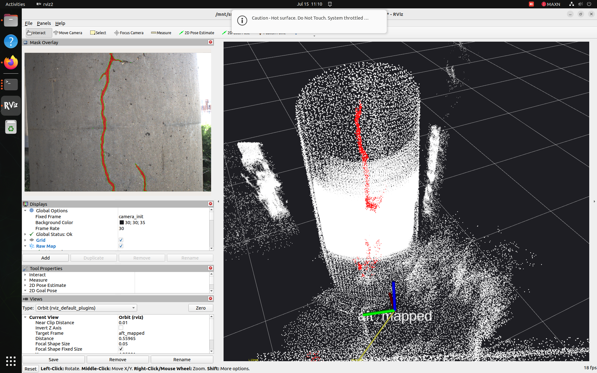

# crack-detection-ros2

Real-time concrete crack detection, 3D fusion, and measurement for ROS2 Humble on NVIDIA Jetson AGX Orin, fused with FAST-LIVO2 colored point clouds.

Implements the methodology from [Deng et al. 2025 (arXiv:2501.09203)](https://arxiv.org/abs/2501.09203) adapted for live mobile robot deployment, using a pretrained UNet16 crack model instead of the paper's DeepLab+SAM pipeline for real-time performance on embedded hardware.

[](https://docs.ros.org/en/humble/)
[](https://developer.nvidia.com/embedded/jetson-agx-orin)
[](LICENSE)

---

## Demo

Real-world test on a bridge support column crack:

| Real crack | Live detection in RViz |
|:---:|:---:|
|  |  |

The 2D camera view (top-left panel) shows the UNet16 segmentation mask overlaid on the live crack, while the 3D view shows the LINE_STRIP crack trace projected onto the local point cloud map, correctly following the crack's actual path down the column.

---

## Table of Contents

- [System Architecture](#system-architecture)
- [Hardware Requirements](#hardware-requirements)
- [Dependencies](#dependencies)
- [Installation](#installation)
- [Configuration](#configuration)
- [Operating Manual](#operating-manual)
- [Topics Reference](#topics-reference)
- [Troubleshooting](#troubleshooting)
- [Key Implementation Notes](#key-implementation-notes)

---

## System Architecture

### Data flow diagram

```
┌─────────────────┐     ┌──────────────────────┐     ┌─────────────────┐
│  Livox Mid-360   │     │ HIKrobot MV-CA016-10UC│     │   Built-in IMU   │
│  (LiDAR)          │     │  (Camera)             │     │  (Mid-360)       │
└────────┬─────────┘     └──────────┬───────────┘     └────────┬─────────┘
         │ /livox/lidar             │ /left_camera/image        │ /livox/imu
         │                          │                            │
         └──────────────┬───────────┴────────────────────────────┘
                         ▼
              ┌─────────────────────┐
              │   FAST-LIVO2 (SLAM)  │   LIO + VIO fusion
              │                       │
              │  Publishes:           │
              │  /cloud_registered    │───┐  (world-frame XYZ+RGB point cloud)
              │  /aft_mapped_to_init  │───┤  (LIO pose, ~9Hz)
              │  /tf (camera_init →   │   │
              │       aft_mapped)     │   │
              └───────────┬───────────┘   │
                          │ /left_camera/image (relayed)
                          ▼               │
              ┌─────────────────────┐     │
              │  crack_seg            │     │
              │  (UNet16, ~8Hz)        │     │
              │  Publishes:            │     │
              │  /crack/mask           │     │
              │  /crack/mask_viz       │     │
              └───────────┬─────────────┘     │
                          │                   │
                          ▼                   ▼
              ┌───────────────────────────────────────┐
              │  crack_fusion                           │
              │  Projects 2D mask onto 3D cloud using   │
              │  the LIO pose at mask-capture time.     │
              │  Range-gated to 0.5m (configurable).    │
              │  Publishes:                              │
              │  /crack/semantic_cloud (all pts+label)   │
              │  /crack/crack_cloud (crack pts only)     │
              └───────────────────┬───────────────────┘
                                  │
                                  ▼
              ┌───────────────────────────────────────┐
              │  crack_measure                           │
              │  DBSCAN clustering + PCA skeleton        │
              │  Publishes:                               │
              │  /crack/measurements (JSON: L/W per crack)│
              │  /crack/markers (LINE_STRIP + text label) │
              └───────────────────────────────────────┘

              ┌───────────────────────────────────────┐
              │  crack_map_accumulator                    │
              │  Voxel-deduplicated, ever-growing map     │
              │  with crack labels carried through         │
              │  Publishes: /crack/accumulated_map          │
              └───────────────────────────────────────┘

              ┌───────────────────────────────────────┐
              │  range_limited_cloud                      │
              │  Accumulates /cloud_registered persistently,│
              │  filters to points within max_range_m of    │
              │  CURRENT sensor position at publish time —  │
              │  gives a "sliding window" local map that     │
              │  follows the sensor (RViz has no native      │
              │  per-point distance filter)                  │
              │  Publishes: /cloud_registered_range_limited  │
              └───────────────────────────────────────┘
```

### Node summary

| Node | Role | Rate |
|------|------|------|
| `crack_segmentation_node.py` | 2D crack detection (UNet16) | ~8 Hz |
| `crack_fusion_node.py` | 2D→3D projection using LIO pose | ~9 Hz |
| `crack_measurement_node.py` | DBSCAN + PCA width/length + LINE_STRIP viz | ~9 Hz |
| `crack_map_accumulator_node.py` | Persistent voxel-deduplicated crack map | 2 Hz publish |
| `range_limited_cloud_node.py` | Local sliding-window base map for RViz | 5 Hz publish |

---

## Hardware Requirements

| Component | Specification |
|-----------|--------------|
| Compute | NVIDIA Jetson AGX Orin (JetPack 6.1, R36.4) |
| LiDAR | Livox Mid-360 |
| Camera | HIKrobot MV-CA016-10UC |
| IMU | Built into Mid-360 |

---

## Dependencies

### System
- ROS2 Humble
- FAST-LIVO2 (ROS2 port) — [sumoon-robotics/FAST-LIVO2-ROS2](https://github.com/sumoon-robotics/FAST-LIVO2-ROS2-Arduino-Nano-ESP32-WiFi-NTP-time-synchronization)
- CUDA 12.6+ (via JetPack)

### Python
```bash
pip3 install torch torchvision  # use NVIDIA JetPack wheels, not PyPI
pip3 install scipy scikit-learn "numpy<2"
```

> **Note**: `numpy<2` is required — `opencv-python` will want numpy≥2, but `torch`/`torchvision` JetPack builds need numpy<2. numpy 1.26.4 is the working compromise; this is a known, harmless conflict.

### Model Checkpoints
```bash
mkdir -p /mnt/ssd/models

# UNet16 crack segmentation model (117 MB) — trained on 11,200 images
# from 12 public crack datasets (CRACK500, DeepCrack, GAPs384, etc.)
pip3 install gdown
gdown "https://drive.google.com/uc?id=1wA2eAsyFZArG3Zc9OaKvnBuxSAPyDl08" \
  -O /mnt/ssd/models/unet_vgg16_crack.pt

# Clone the crack_segmentation repo — needed for the UNet16 architecture
# definition (we import it directly, not re-implement it)
git clone https://github.com/khanhha/crack_segmentation.git /mnt/ssd/crack_segmentation
```

---

## Installation

```bash
cd /path/to/your/ros2_ws/src
git clone https://github.com/sumoon-robotics/crack-detection-ros2.git
cd ..
colcon build --packages-select crack_livo_fusion --symlink-install
source install/setup.bash
```

---

## Configuration

Edit `crack_livo_fusion/config/params.yaml` before running:

### Required: Camera intrinsics (from your calibration)
```yaml
crack_fusion:
  ros__parameters:
    fx: 879.098   # ← replace with your actual values
    fy: 879.804
    cx: 352.076
    cy: 272.032
    img_w: 720
    img_h: 540
```

### Required: LiDAR-camera extrinsic (from your calibration)
```yaml
    # From FAST-LIVO2 config: extrin_calib.Rcl / Pcl
    # NOTE: Rcl/Pcl in FAST-LIVO2 IS T_cam_lidar (p_cam = Rcl @ p_lidar + Pcl)
    # Do NOT invert — use directly as-is from your mid360_hikrobot.yaml
    T_lidar_cam: [
      -0.002170, -0.999962,  0.008495,  0.034932,
       0.362654, -0.008704, -0.931883, -0.040393,
       0.931922,  0.001058,  0.362658, -0.037527,
       0.0,       0.0,       0.0,       1.0
    ]
```

### Optional: Detection range gate
```yaml
    max_range_m: 0.5   # only detect cracks within 0.5m of the sensor
                        # (tighter range = less false-positive noise from
                        # distant background clutter, at the cost of coverage)
```

### `range_limited_cloud` — local map display range
```yaml
range_limited_cloud:
  ros__parameters:
    max_range_m: 1.5   # size of the "local sliding window" base map in RViz
                        # (independent of the crack detection range gate above)
```

---

## Operating Manual

This system requires **5 terminals** running in a specific dependency order. Sensors and SLAM must be alive before the crack pipeline starts.

### Terminal 1 — Livox Mid-360 LiDAR driver
```bash
~/start_mid360.sh
```
Wait for: `Init lds lidar success!` and IMU/lidar publish confirmation.

### Terminal 2 — HIKrobot camera driver
```bash
export LD_PRELOAD=/usr/lib/aarch64-linux-gnu/libusb-1.0.so.0
source /opt/ros/humble/setup.bash
source /path/to/ros2_ws/install/setup.bash
ros2 launch mvs_ros2_cam mvs_camera.launch.py
```
Wait for: `HIKrobot grabbing — topic: /left_camera/image`.

> If you see `OpenDevice fail 0x80000203`, a previous camera process is still holding the device. Find and kill it: `ps aux | grep grab_trigger`, then `kill -9 <pid>`.

### Terminal 3 — FAST-LIVO2 SLAM
```bash
source /opt/ros/humble/setup.bash
source ~/ws_livox/install/setup.bash
source /path/to/ros2_ws/install/setup.bash
LD_PRELOAD=/usr/lib/aarch64-linux-gnu/libusb-1.0.so.0 \
  ros2 launch fast_livo mapping_mid360_hikrobot.launch.py use_rviz:=False
```
Wait for: repeating `VIO Time` / `LIO Mapping Time` tables — this confirms SLAM is tracking.

Verify all required topics exist before continuing:
```bash
ros2 topic list | grep -E "cloud_registered|aft_mapped|left_camera"
```

### Terminal 4 — Crack detection pipeline
```bash
source /opt/ros/humble/setup.bash
source /path/to/ros2_ws/install/setup.bash
ros2 launch crack_livo_fusion crack_detection.launch.py
```
Wait for all 5 nodes to report ready (`crack_seg`, `crack_fusion`, `crack_measure`, `crack_map_accumulator`, `range_limited_cloud`).

### Terminal 5 — RViz visualization
```bash
LIBGL_ALWAYS_SOFTWARE=1 rviz2 -d \
  $(ros2 pkg prefix crack_livo_fusion)/share/crack_livo_fusion/config/crack_detection.rviz
```
`LIBGL_ALWAYS_SOFTWARE=1` avoids a `GLXBadDrawable` crash that occurs intermittently on Jetson when RViz's GPU context conflicts with the GPU-heavy inference nodes already running.

### Default RViz displays

| Display | Default | Shows |
|---------|---------|-------|
| Raw Map | ON | Local 1.5m sliding-window base map (white) |
| Crack Cloud | ON | Detected crack points as flat squares (red) |
| Markers | ON | LINE_STRIP crack skeleton + L/W text label |
| Sensor Pose (TF) | ON | Live XYZ axes at sensor position |
| Mask Overlay | ON | 2D camera feed with crack contour overlay |
| Semantic Cloud | OFF | Full cloud + crack channel (toggle on if needed) |
| Accumulated Map | OFF | Full crack-labeled history (toggle on if needed) |

To re-center the camera view on the sensor after moving: hover over the 3D viewport and press **`f`**.

### Ending a session (saving the full building map)

Go to **Terminal 3** and press **Ctrl+C once**, then wait — do not press it again. A custom signal handler in FAST-LIVO2 saves the full point cloud map on shutdown:
```
Raw point cloud data saved to: .../FAST-LIVO2/Log/pcd/all_raw_points.pcd
Downsampled point cloud data saved to: .../FAST-LIVO2/Log/pcd/all_downsampled_points.pcd
```
This requires `pcd_save_en: true` in FAST-LIVO2's `mid360_hikrobot.yaml` and a custom SIGINT handler patch in FAST-LIVO2's `main.cpp` (see [Key Implementation Notes](#key-implementation-notes)) — without it, `rclcpp`'s default shutdown does not reliably let the save logic run before the process exits.

---

## Topics Reference

| Topic | Type | Description |
|-------|------|-------------|
| `/crack/mask` | `sensor_msgs/Image` | Binary crack mask (mono8) |
| `/crack/mask_viz` | `sensor_msgs/Image` | Camera overlay with contour (bgr8) |
| `/crack/semantic_cloud` | `sensor_msgs/PointCloud2` | Full cloud + crack channel |
| `/crack/crack_cloud` | `sensor_msgs/PointCloud2` | Crack points only |
| `/crack/measurements` | `std_msgs/String` | JSON: per-crack length/width/position |
| `/crack/markers` | `visualization_msgs/MarkerArray` | LINE_STRIP skeleton + text labels |
| `/crack/accumulated_map` | `sensor_msgs/PointCloud2` | Live growing persistent crack map |
| `/cloud_registered_range_limited` | `sensor_msgs/PointCloud2` | Local sliding-window base map |

---

## Troubleshooting

**Zero crack detections on an obvious real crack**
Check the actual model confidence: `ros2 topic echo /rosout --field msg | grep "Crack pixels"`. If confidence is high (>0.9) on background clutter (cables, shelving), this is a genuine model limitation, not a threshold issue — raising the threshold further will start missing real cracks too. The fix is fine-tuning UNet16 on your own scene photos, not a config change.

**RViz shows `GLXBadDrawable` and crashes**
Use `LIBGL_ALWAYS_SOFTWARE=1` (see Operating Manual above). This forces software OpenGL rendering, avoiding the GPU context conflict between RViz and the GPU-heavy inference nodes.

**RViz Displays panel disappears / window shows solid black**
The `.rviz` config file is likely corrupted YAML (often from manual `sed` edits breaking indentation). Validate it:
```bash
python3 -c "import yaml; yaml.safe_load(open('path/to/crack_detection.rviz'))"
```
If it errors, restore from a known-good version rather than continuing to patch.

**Point cloud shows real distant background instead of local area**
Confirm the Raw Map display's Topic is `/cloud_registered_range_limited`, not `/cloud_registered`, and its Decay Time is `0` (not a large number — large Decay Time causes RViz to render many past "local bubbles" from different past sensor positions simultaneously, which looks like the whole room).

**Livox driver: `bind failed` / `Failed to init livox lidar sdk`**
A previous driver instance is still holding the socket. Find and kill it:
```bash
ps aux | grep -i livox
kill -9 <pid>
```

**HIKrobot camera: `OpenDevice fail 0x80000203`**
Same root cause — a zombie `grab_trigger` process from an earlier run. `ps aux | grep grab_trigger`, then `kill -9 <pid>`.

**"System throttled due to Over-current" warning**
This is a Jetson hardware power warning (drawing more current than the current NVPModel allows), not a software bug. Check `sudo nvpmodel -q`. Generally does not affect correctness, only occasionally causes brief performance dips.

---

## Key Implementation Notes

**Extrinsic direction (critical, easy to get backwards)**: FAST-LIVO2's `Rcl`/`Pcl` parameters map LiDAR-frame points directly into camera frame: `p_cam = Rcl @ p_lidar + Pcl`. This means `Rcl`/`Pcl` together already **is** `T_cam_lidar` — do not invert it before use. This was confirmed by reading FAST-LIVO2's `src/vio.cpp`: `Pci = Rcl * Pli + Pcl`. An earlier version of this pipeline incorrectly inverted this matrix, causing all projected points to land wildly outside the image (`u`/`v` values in the tens of thousands instead of 0-720/0-540) — if you see similar wild misprojection, check this first.

**Range gates serve two different purposes**: `crack_fusion`'s `max_range_m` (default 0.5m) controls what counts as a *crack detection* — kept tight to reduce false positives from distant background clutter. `range_limited_cloud`'s `max_range_m` (default 1.5m) controls what's *visually displayed* as the base map in RViz — independent of crack detection, just a viewing convenience.

**Crack model is used as-is, no fine-tuning needed**: the UNet16 model from `khanhha/crack_segmentation` was trained on 11,200 real crack images across 12 datasets and generalizes well to concrete/structural surfaces directly, unlike domain-specific detectors (e.g. door detection) that require fine-tuning on the target environment.

**LINE_STRIP over point-cloud dots or spheres for crack visualization**: LiDAR point density at typical inspection range (~0.5m) gives roughly 3-5mm point spacing — too sparse to visually read as a continuous crack trace no matter how the points are styled (spheres, flat squares, etc. all show gaps). The fix is publishing a `LINE_STRIP` marker through the PCA-sorted skeleton points, which visually connects the dots into the actual crack path.

**"Local map that follows the sensor" is not a native RViz feature**: RViz has no built-in per-point distance filter for `PointCloud2` displays. `range_limited_cloud_node` exists specifically to pre-filter `/cloud_registered` before it reaches RViz — it maintains its own persistent voxel-deduplicated store (so points are never truly lost) but only republishes points within `max_range_m` of the sensor's *current* position at each publish tick, giving the effect of a map that "follows" the sensor.

---

## Related Work

- [Deng et al. 2025 — arXiv:2501.09203](https://arxiv.org/abs/2501.09203)
- [khanhha/crack_segmentation](https://github.com/khanhha/crack_segmentation)
- [FAST-LIVO2](https://github.com/hku-mars/FAST-LIVO2)

---

## Citation

If you use this work, please cite the paper this implementation is based on:

```bibtex
@article{deng2025crack,
  title={...},
  author={Deng et al.},
  journal={arXiv:2501.09203},
  year={2025}
}
```

---

## License

MIT License — see [LICENSE](LICENSE)

## Author

Son Thanh Nguyen — [Sumoon LLC](https://sumoon.net) / Missouri S&T CII/INSPIRE UTC
